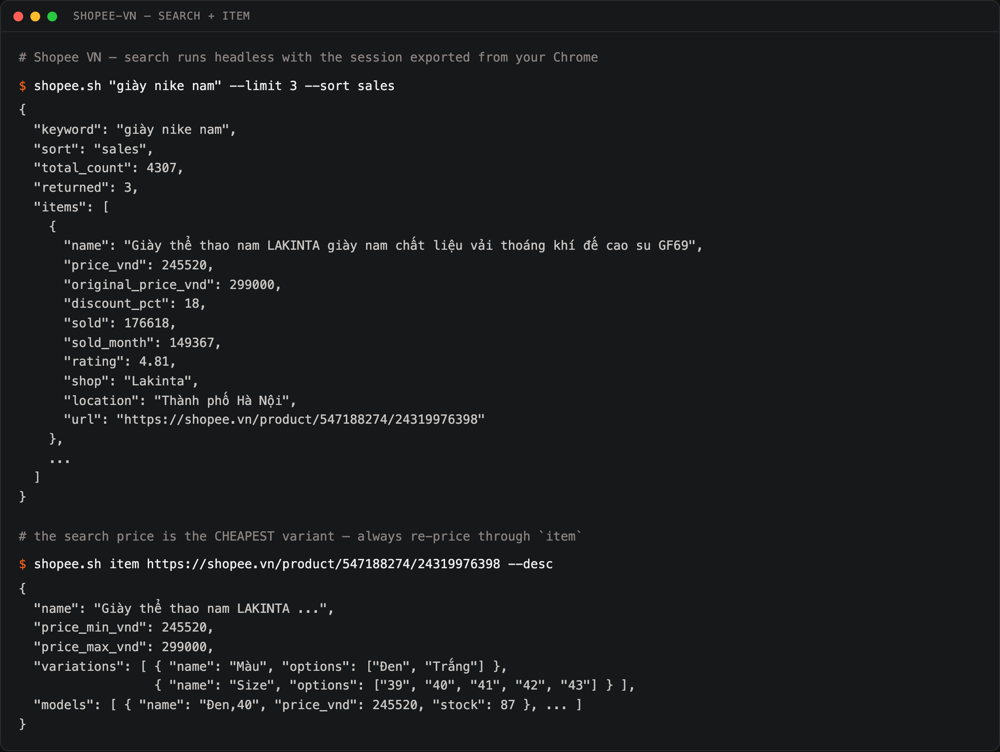
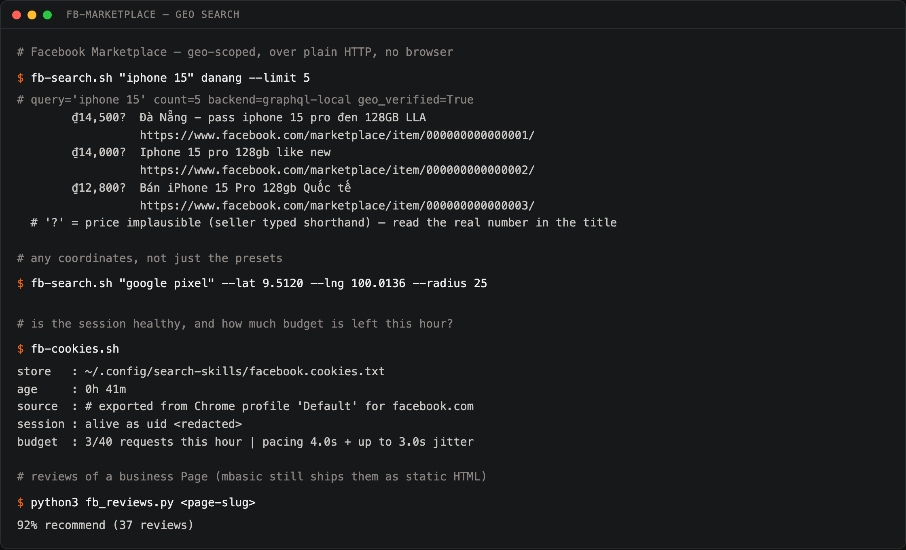
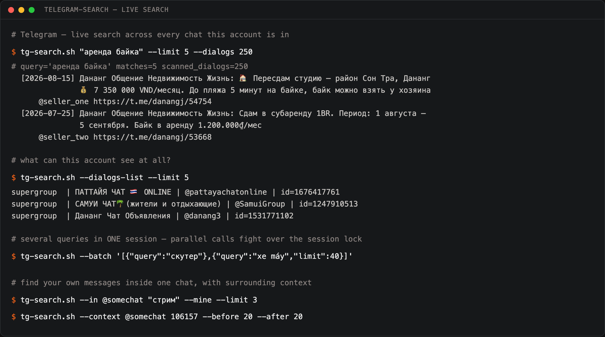

# search-skills

Three agent skills for **live** search on platforms that have no usable public API:
Shopee Vietnam, Facebook Marketplace and Telegram. Each one drives *your own*
logged-in session, returns structured JSON, and documents the anti-bot walls it
had to get through — so an LLM agent (or you) can ask "what does this cost here,
who sells it, and what do buyers complain about" and get a real answer.

| Skill | What it answers | How |
|---|---|---|
| [shopee](skills/shopee/SKILL.md) | VN **and TH** prices, sold counts, variants, reviews, cart, order history | headless Chromium + the real Chrome for writes, or a remote browser over CDP |
| [shopee-th](skills/shopee-th/SKILL.md) | the same for shopee.co.th, which blocks headless entirely | live DOM of a real browser |
| [remote-browser](skills/remote-browser/SKILL.md) | drive a logged-in browser on another machine: batched actions, GraphQL capture, tab hygiene | one SSH tunnel to CDP + Playwright |
| [fb-marketplace](skills/fb-marketplace/SKILL.md) | second-hand prices in a specific city, seller listings, Page reviews | plain HTTP replay of the Marketplace GraphQL query |
| [telegram-search](skills/telegram-search/SKILL.md) | what people actually post in local chats: listings, contacts, rentals | Telethon over your joined chats |

No scraping farm, no proxies, no account farms: every skill is a thin, paced
wrapper around a session you already have. (A separate secondary account for
classifieds is recommended for Telegram — see that skill's doc.)

---

## Shopee VN — prices, variants, reviews, cart



```bash
S=./skills/shopee/scripts/shopee.sh

$S "giày nike nam" --limit 10 --sort sales        # search (headless)
$S item <product-url> --desc                      # variants, per-model stock, real contents
$S reviews <product-url> --live --stars 1         # the only reviews worth reading
$S cart                                           # read the live cart
$S add <url> --variant "Trắng" --qty 2            # write — goes through your real Chrome
$S orders                                         # what was actually charged
```

Three things this skill exists to tell you, all learned the hard way:

* the **search price is the cheapest variant's** price — re-price through `item`
  before quoting anything;
* the **title lies about what is in the box** — only `--desc` lists the real
  contents (a "4-piece set" turned out to have no duvet cover);
* **star averages are useless** (everything sells at 4.8) — read the 1-star
  bucket and compute its share.

Cart *writes* cannot be automated at all from a scripted browser: Shopee's risk
engine refuses them with `error 90309999`, including a replayed signed request.
They run as JavaScript inside your real Chrome through a small AppleScript
applet — build it with `./skills/shopee/bridge/build_bridge.sh`.

## Facebook Marketplace — geo-scoped second-hand prices



```bash
S=./skills/fb-marketplace/scripts

$S/fb-search.sh "iphone 15" danang --limit 10
$S/fb-search.sh "giày" hcmc --min 300000 --max 3000000
$S/fb-search.sh "google pixel" --lat 9.5120 --lng 100.0136 --radius 25
$S/fb-search.sh "giày" hcmc --days 7 --shipping     # fresh listings, shipping only
$S/fb-cookies.sh                                   # session alive? budget left?
python3 $S/fb_reviews.py <page-slug>               # "92% recommend (37 reviews)"
```

The default path sends **one HTTPS request** — it replays the same GraphQL query
the Marketplace page makes, with your cookies and a freshly scraped `fb_dtsg`.
Geo is real (lat/lng/radius) for the preset cities and for any coordinates you
pass. With no city and no coordinates the search falls back to your account's
location and says so: `geo_verified: false` plus a warning line.

Because this runs on a real personal account it is paced on purpose: ≥4 s +
jitter between requests, 40 requests/hour, and hard-stop detection of Facebook's
checkpoint markers (exit code 4 means *stop*, not *retry*).

Cities preset: `bangkok pattaya phuket samui phangan chiangmai krabi danang hcmc
saigon hanoi nhatrang hoian` — anything else via `--lat/--lng/--radius`.
Exit codes matter here: `4` means Facebook flagged the session — stop, never retry.

## Telegram — what people post in local chats



```bash
S=./skills/telegram-search/scripts

$S/tg-search.sh "аренда байка" --limit 20 --dialogs 250
$S/tg-search.sh "iphone" --channel danang --since 2026-09-01T00:00:00
$S/tg-search.sh --in @somechat "стрим" --mine      # your own messages in one chat
$S/tg-search.sh --context @somechat 106157 --before 20 --after 20
$S/tg-search.sh --batch '[{"query":"скутер"},{"query":"xe máy","limit":40}]'
```

Telegram has no cross-chat search API, so the reader iterates your dialogs and
searches each one. **Scanning fewer than ~200 dialogs silently returns zero
matches** for queries that do have hits — that single fact is why this wrapper
exists.

---

## Remote browser — one logged-in browser, driven from anywhere

Some sites cannot be read from a script at all: Facebook groups need a real
session, lazy feeds need a visible tab, and a *background* tab in Chrome makes
no network requests at all — so nothing ever loads. This skill drives a
persistent, already-logged-in Chrome on another machine over CDP.

```bash
skills/remote-browser/scripts/tunnel.sh          # one SSH tunnel in tmux, reconnects itself
node skills/remote-browser/scripts/rbrowser.js '[
  {"do":"goto","url":"https://example.com","wait":"h1"},
  {"do":"list","sel":"a","fields":["text","href"],"as":"links"}
]'
```

A whole interaction is one call: `goto`, `wait`, `click` (by selector *or* by
visible text), `type` (native setter + bubbling events, for controlled React
inputs), `scroll` (waits for the document to grow, not for a timer), `eval`,
`text`, `html`, `attr`, `list`, `gql` + `gqlDump` (capture `/api/graphql`
responses), `shot`, `cookies`. The reply is JSON with every step's duration, so
a slow step is visible instead of guessed.

Tab hygiene is part of the skill, not an afterthought: its own tab is reused
(marked via `addInitScript`, so the mark survives navigation) and parked on
`about:blank` afterwards; `--tabs` reports the state; `--cleanup` closes only
its own leftovers and never touches domains you listed as holding live
sessions. Left unattended it once piled up 24 pages, 17 of them abandoned
login screens.

## Install

Requires Node 18+ and Python 3.10+.

```bash
git clone https://github.com/axelbaumlisto/search-skills && cd search-skills
npm install                                   # playwright, for the Shopee skill and doc shots
python3 -m venv .venv && ./.venv/bin/pip install -r requirements.txt
export PYTHON_BIN="$PWD/.venv/bin/python"     # every wrapper honours this

mkdir -p ~/.config/search-skills
cp .env.example ~/.config/search-skills/.env && chmod 600 ~/.config/search-skills/.env
```

Personal settings — ssh host of the remote browser, which domains hold your
live sessions, where the cookie export lives — go into one JSON file outside
this repo and are picked up via `SKILLS_CONFIG` (see the section at the end).

Note: only the Telegram scripts read that `.env`. Shopee and Facebook variables
must be exported in your shell (they all have working defaults).

Then per skill, once:

```bash
# Shopee: export the session from your local Chrome
./skills/shopee/scripts/shopee.sh --refresh-cookies && ./skills/shopee/scripts/shopee.sh --check
# Shopee cart writes only: build the AppleScript bridge (macOS)
./skills/shopee/bridge/build_bridge.sh

# Facebook: export cookies, then capture the GraphQL template once
./skills/fb-marketplace/scripts/fb-cookies.sh refresh
#   -> skills/fb-marketplace/templates/README.md (about a minute in DevTools)

# Telegram: put TG_API_ID/TG_API_HASH in the .env, then authorize
./skills/telegram-search/scripts/tg-search.sh --login
```

Every credential lives in `~/.config/search-skills/` (cookies, sessions,
rate-limit state, GraphQL template); the only other runtime paths are the
bridge staging dir `/tmp/search-skills-bridge` and the remote job's temp files.
`.gitignore` covers sessions, cookie jars and the captured template — but the
repo can only protect what you keep out of it, so check `git status` before
your first push.

## Layout

```
skills/<name>/SKILL.md      agent-facing doc: commands + hard-won rules
skills/<name>/scripts/      the actual CLI, one concern per file
skills/shopee/scripts/browser.cjs   picks the backend: local bridge or remote CDP
skills/remote-browser/scripts/rbrowser.js  batched browser actions -> JSON
skills/remote-browser/scripts/tunnel.sh    the tmux SSH tunnel both of them use
shared/chrome_cookies.py    export cookies for a host from the local Chrome (macOS Keychain)
examples/*.json             real output of each skill, trimmed and redacted
docs/shot.mjs               render a terminal transcript into a README screenshot
tests/run.sh                everything checkable without a live session: syntax,
                            unit tests for the GraphQL/parsing layer, secret scan
```

Each `SKILL.md` is written to be dropped into an agent harness (Claude Code /
pi / Cursor rules) as-is: the description line is the routing trigger, the body
is what the model needs to not repeat a mistake someone already paid for.

## Honest limits

* **These are your accounts.** Every request is logged against them; there is no
  anonymous mode. Keep volume human, or use a secondary account.
* **macOS-first.** Cookie export reads the Chrome Safe Storage Keychain entry and
  the Shopee cart bridge is an AppleScript applet. The Facebook and Telegram
  paths are plain Python and run anywhere.
* **Session, not scraper.** Shopee search needs a browser (the API requires a
  signature computed by page JS), Facebook needs a captured `doc_id`, Telegram
  needs a real login. All three break if you try to turn them into a crawler.
* **Things rotate.** Facebook's `doc_id` changes with client builds, Shopee
  changes its cart DOM; when something breaks, the fix is documented in the
  relevant `SKILL.md` rather than hidden in code.

## License

MIT — see [LICENSE](LICENSE).

## Personal settings stay out of this repo

Nothing here knows your hosts, cookie paths or which tabs belong to a live
session of yours. Those live in one JSON file outside the repo:

```bash
export SKILLS_CONFIG=/path/to/skills.json
```

```json
{
  "remoteBrowser": { "sshHost": "my-server", "cdpRemotePort": 9222, "cdpLocalPort": 9224 },
  "protectedDomains": ["shopee.vn", "accounts.google.com"],
  "cookies": { "facebook": "~/.secrets/facebook.cookies.txt", "chromeProfile": "Default" }
}
```

Without it the skills fall back to generic defaults — they still run, they
just don't know anything about your machine.

### lazada

Purchase history and catalogue search for Lazada Thailand, driven through the same
local-Chrome bridge as the Shopee skills.

```bash
skills/lazada/scripts/lazada.sh orders --query "monitor"
skills/lazada/scripts/lazada.sh search "portable monitor touch"
```

History is read from the page's own Ultron endpoint, so a long history takes under
ten requests instead of one click per page. Catalogue search does not depend on the
browser window being visible — unlike Shopee TH search, which does.

## Installation-specific paths

Nothing machine-specific is baked into the skills. Sessions, interpreters and helper
scripts are located through environment variables, each with a sane default:

| variable | default | used by |
|---|---|---|
| `SHOPEE_COOKIE_DIR` | `~/.config/shopee-search/cookies` | shopee, shopee-th |
| `SHOPEE_PYTHON` | `python3` | shopee cookie export |
| `FB_COOKIES` | `~/.config/fb-marketplace/facebook.cookies.txt` | fb-marketplace |
| `FB_TEMPLATE`, `FB_STATE` | under `~/.config/fb-marketplace/` | fb-marketplace HTTP path |
| `FB_BROWSER_SCRIPTS` | `~/.config/fb-marketplace/browser-scripts` | fb-marketplace query layer |
| `FB_REMOTE_DIR`, `FB_REMOTE_SCRIPT` | `.`, `fb_marketplace.py` | fb-marketplace browser fallback |
| `REMOTE_NODE_MODULES` | — | remote-browser |
| `SHOPEE_NODE_MODULES` | `node_modules` next to the skill | shopee headless search |
| `TG_HOME` | `~/.config/telegram-search` | telegram-search |
| `TG_ENV` | `$TG_HOME/.env` | telegram-search credentials file |

`fb_marketplace.py` (GraphQL template, city table, edge parsing) is installed separately;
without it the fb-marketplace HTTP path exits with a clear message and its unit tests skip.
